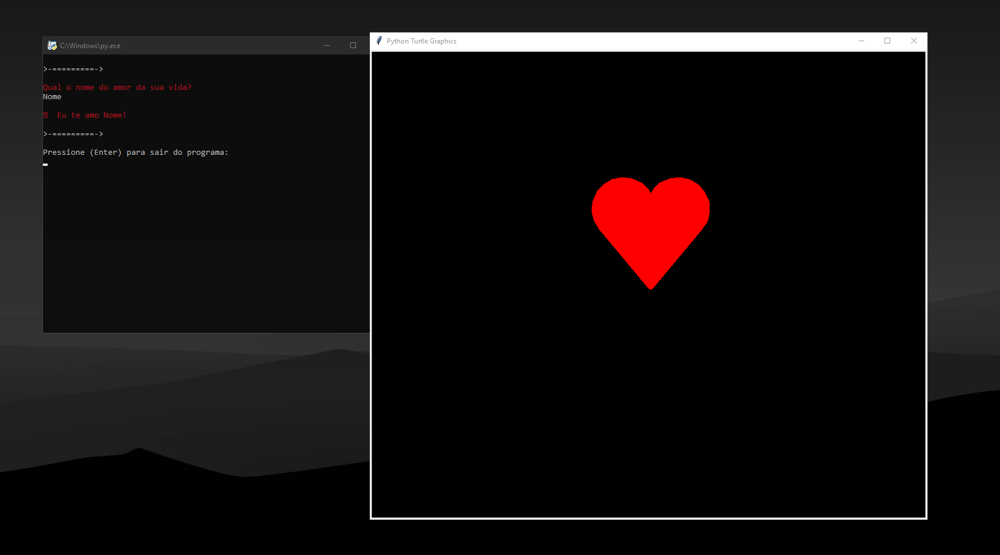

# HeartPY
### ↪Um dos projetos mais simples que fiz utilizando Python, Uma forma de impressionar sua Crush!

# Como executar?
### É facíl! Primeiro instale o [Python](https://www.python.org/downloads/), após isso baixe os arquivos aqui do Github abra a pasta atráves do CMD (Prompt Comando) e instale as depêndencias localizadas em `requirements.txt`.

#### ```pip install turtle```
#### ```pip install termcolor```

### Após isso se estiver no `Windows 10` basta dar dois cliques e pronto, Ou atráves do terminal aberto na pasta do projeto execute `python main.py` e pronto!


